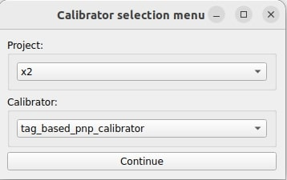
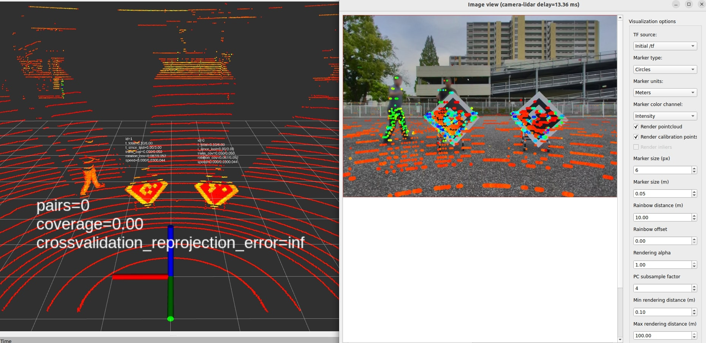
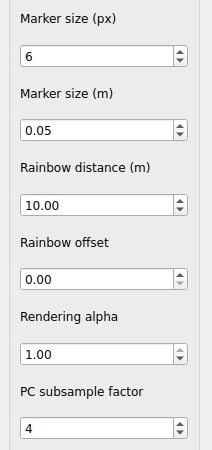
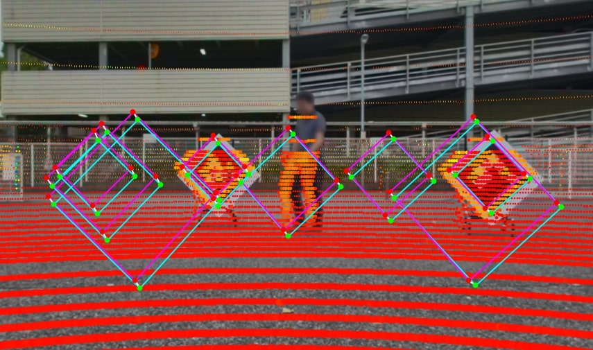
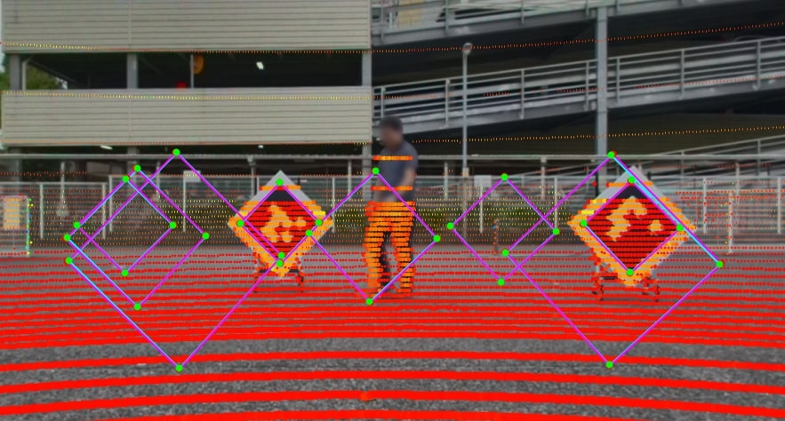

# tag_based_pnp_calibrator

In this tutorial, we will present a hands-on tutorial of the `tag_based_pnp_calibrator`. Although we provide pre-recorded rosbags, the flow of the tutorial is meant to show the user the steps they must perform in their own use cases with live sensors.

General documentation regarding this calibrator can be found [here](../../tag_based_pnp_calibrator/README.md).

## Setup

This tutorial assumes that the user has already built the calibration tools.
Installation instructions can be found [here](../../README.md)

## Data preparation

Please download the data (rosbag) from [here](https://drive.google.com/drive/folders/1gFrrchW9mWM1huWMYuJ0nWB2n1BfCJag?usp=drive_link).

The rosabg includes four different topics including `camera_info`, `image_rect_color/compressed`, `pointcloud_raw`, and `/tf_static`.

## Environment preparation

### Overall calibration environment

The required space for calibration depends on the vehicle and sensors used. For a normal consumer-level car, a space of `5m x 10m` should be sufficient.

### Apriltag

Apriltag are the only moving elements during the calibration process and must detected by both cameras and lidars.
Depending on the lidar model and the available space, the required Apriltag size may vary, but so far we have had good results with 0.6m and 0.8m tags (the provided sizes correspond to an edge's size. In these cases the payloads are 0.45m and 0.6m).

In addition to the Apriltag size, which determines the physical positions in which a tag can be detected, it is of equal importance the structure in which the Apriltag is mounted. Depending on the structure's shape and size, it may interfere with the lidar detection algorithm, so it is recommended to prepare a mount that holds the tag in a way that is not visible to the sensor (see the provided example).

## Launching the tool

In this tutorial, we will use the X2 vehicle of Tier IV.
First, run the sensor calibration manager:

```bash
ros2 run sensor_calibration_manager sensor_calibration_manager
```

In `project`, select `x2`, and in `calibrator`, select `tag_based_pnp_calibrator`. Then, press `Continue`.



A menu titled `Launcher configuration` should appear in the UI, and the user may change any parameter he deems convenient.
For this tutorial, we will modify the default values `calibration_pairs` from `9` to `8` as the bag have 8 Apriltag detection and also modify the `camera_name` from `camera0` to `camera6`. After configuring the parameters, click `Launch`.


The following UI should be displayed. When the `Calibrate` button becomes available, click it.
If it does not become available, it means that either the required `tf` or services are not available.

In this tutorial, since the `tf` are published by the provided rosbags, run the rag (`ros2 bag play camera_lidar.db3 --clock -r 0.1`) first and launch the tools afterward to trigger the `Calibrate` button.


## Calibration

The calibration start automatically after click the `Calibrate` button. It will keep calibrate the lidartag detection and apriltag detection until the number of the detection fit the user defined `calibratino_pairs` in the `Launcher configuration`.

When user start the calibration, `rviz` and the `image view` should be displayed like below.



After the tools detect the lidartag and apriltag, it will shows the detectino markers on the `rviz` and the `image view`. The text in the rviz will also display the current number of lidar detection and apriltag detection pairs.


Once user get the converged detection, user can start moving the tag to another position. Please make sure the moving distance is larger than the `calibration_min_pair_distance` and also make sure the tag is in the view of FOV of the lidar and camera.

In the end of the calibration, we can get 8 detection pairs which shown as below.


## Results

After the calibration process is finished, the sensor_calibration_manager will display the results in the tf tree and allow user to save the calibration data to a file.


User can modify the `visualization options` in the right side of the `image view`. To compare the results easier, user can set the `Marker size (m)` to `0.04` and set the `PC subsample factor` to `1`.



After setting the options above, change the `/initial_tf` (in the `visualization options`) to `/current_tf`. By doing this, user can easily measure the difference after the calibration.

The images below show that with the calibrated tranformation, the projected pointcloud align better with the imaage.




